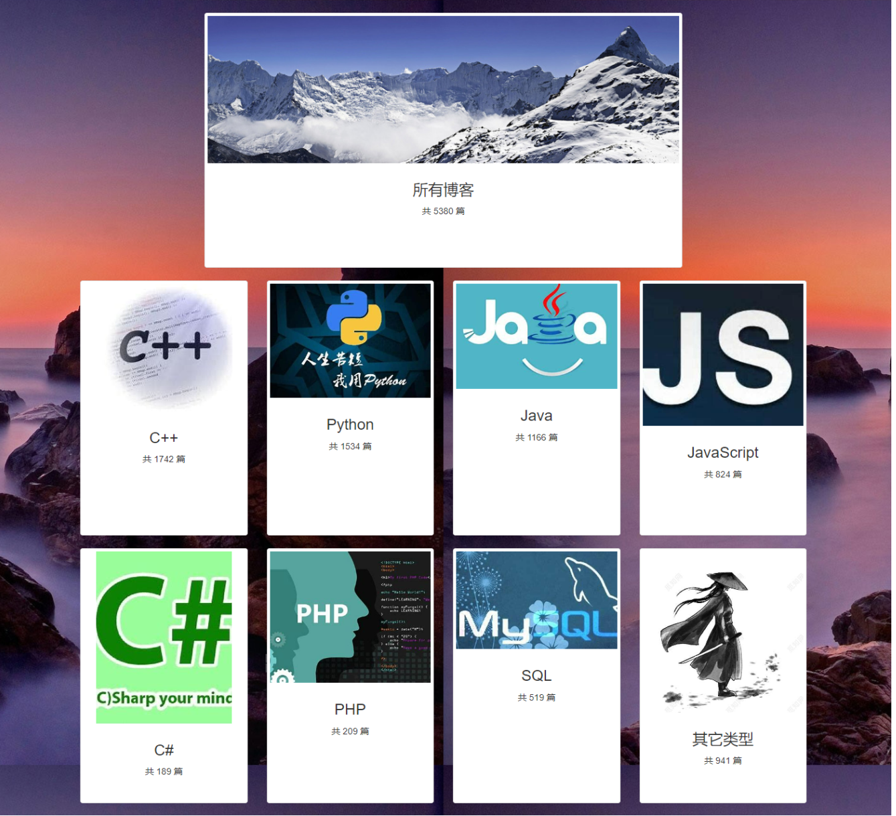

# Mini-CSDN

Homework of Programing and Training. A tiny website built by Django

- Crawled a total of 5,380 blogs from CSDN webpage to local location.  
- Built website by Django , supported keyword search, blog category, local comments and other functions.
- Based on pandas, numpy and other tools, analyzed the posting time pattern and authors’ habits, and visualized the results with matplotlib library.

You can view more details under `.\report`
